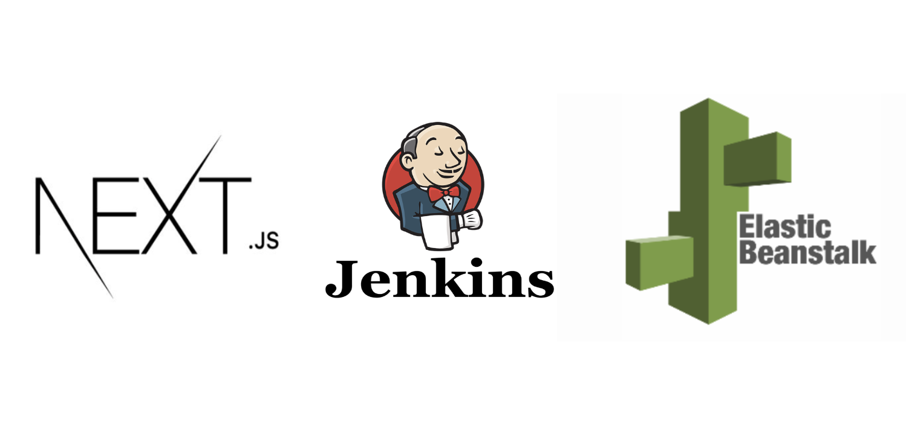
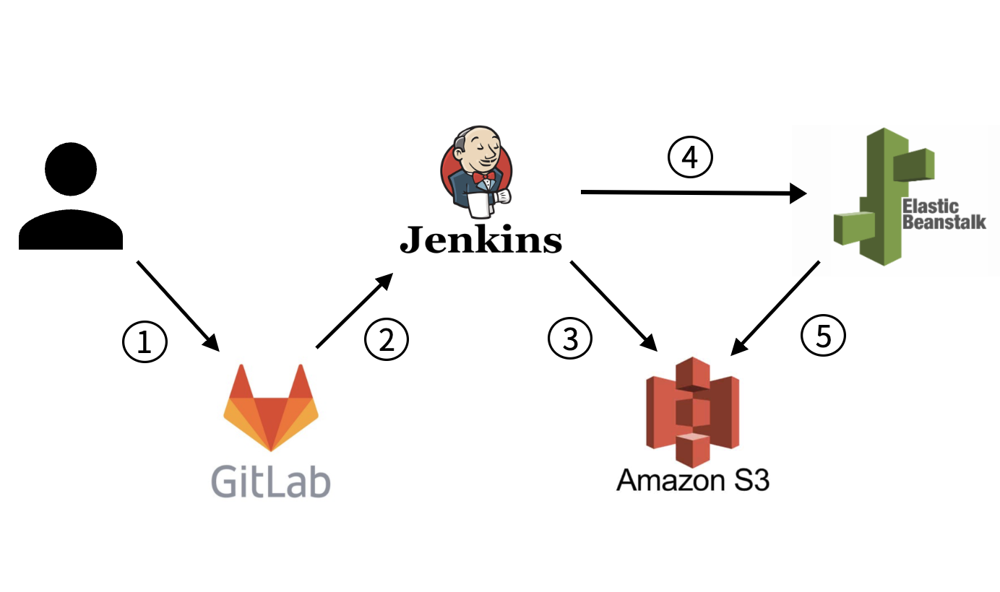

취업을 하고난지 두달이 지났다. 그동안 바쁜 프로젝트 진행과 적응기간을 보내는 동안 블로그 포스팅을 소홀히 했던 것
같아서 취업 전보다는 뜸하겠지만 그래도 남는시간에 틈틈히 글을 써보고자 한다.

현업을 하면서 기존에 프론트엔드 파트의 CI/CD 파이프 라인이 없었기 때문에 구축 해보고자 하였고 프로젝트 대상은 Next프레임워크를 이용한 프로젝트였다. Next와 같은 경우에는 Vercel 이란 훌륭한 배포 플랫폼이 존재하였지만 주로 AWS 솔루션을 이용하는 프로젝트들이 많았기에 동일하게 AWS를 이용한 파이프라인을 구축했다.

일반 CSR기반의 React 프로젝트와 같은 경우는 빌드파일이 정적이기 때문에 단순히 AWS의 S3와 Cloudfront만을 이용하여 프로세스를 구축 할 수 있었지만 Next의 경우에는 SSR을 지원하기 때문에 그 자체가 하나의 서버이므로 EC2 상에 배포해야 했었다. 취업전에 EC2 내의 Docker기반으로 SpringBoot 프로젝트를 배포한 경험이 있었는데 이번에는
버전 관리 및 서비스를 간편하게 배포하고 조정할수 있는 AWS의 로드밸런싱 솔루션인 Elastic Beanstalk을 이용한 경험을 소개해보고자 한다.

참고 : 본 글은 Jenkins설치 및 Webhook설정, S3 버킷, Elb NodeJS 환경의 생성이 끝난 이후의 작업을 담고있다.

## Deployment process

배포 프로세스는 아래 그림과 같으며 AWS S3를 추가적으로 사용한다.



**1. 개발자가 깃랩에 푸시를 한다.**

**2. 깃랩에서 Jenkins로 웹훅을 트리거 한다.**

**3 & 4. Jenkins에서 프로젝트를 처리한다**

- Jenkins에서 프로젝트를 빌드 하고 배포시 필요한 파일을 압축하여 S3에 업로드한다.
- S3에 업로드가 성공적으로 이루어지면 aws CLI를 이용하여 Elb에 버전 및 환경 업데이트 명령을 내린다.

**5. Elb가 S3에 업로드된 파일로 환경을 업데이트한다 (배포 및 재배포)**

원래는 Jenkins가 아닌 Elastick Beanstalk 상에서 빌드를 진행할 수 있지만
Jenkins에서 먼저 빌드를 후 성공했을 때만 S3로 올려 성공한 Build에 대한 압축파일만 업로드하여 버전을 관리 하는것이 더 좋은 방법인것 같았고 Elb상에서 환경변수 등
빌드 시 필요한 자원 혹은 설정을 진행하는 것 보다 Jenkins상에서 진행하는 것이 편해서 Jenkins상에서 선 빌드를 하는것으로 결정하였다.

## Jenkinsfile

위와같은 프로세스를 수행하기 위한 Jenkisfile을 프로젝트의 루트에 생성하였다. Jenkins의 Pipeline 기능을 이용하였다.

```js{30}
// Jenkins가 Linux 환경이라면 bat대신 sh명령어를 사용.
pipeline {
    agent any
    stages {
        stage('Clone Git') {
            steps {
                echo '======Clone-Git======'
                git branch: 'master', credentialsId: 'jeongyunniim', url: '깃 클론 Url'
            }
        }
        stage('Test App') {
            steps {
                echo '======Test-App======'
                echo 'Test process'
            }
        }
        stage('Build App') {
            steps {
                echo '======Build======'
                bat 'npm install --force && npm run build'
            }
        }
        stage('File Compression') {
            steps {
                echo '======File-Compression======'
                script{
                    def packageJson = readJSON file: "package.json"
                    VERSION = packageJson.version
                }
                bat "zip -r 프로젝트이름-${VERSION}.zip .ebextensions .next node_modules public next.config.js package.json package-lock.json"
            }
        }
        stage('Upload to S3') {
            steps {
                echo '======Upload-to-S3======'
                bat "aws s3 cp 프로젝트이름-${VERSION}.zip s3:업로드할 s3 주소"
            }
        }
        stage('Deploy'){
            steps {
                echo '======Deploy======'
                bat "aws elasticbeanstalk create-application-version --application-name Elb어플리케이션이름 --version-label 프로젝트이름-${BUILD_NUMBER} --source-bundle S3Bucket=\"s3 버킷이름\",S3Key=\"프로젝트이름-${VERSION}.zip\""
                bat "aws elasticbeanstalk update-environment --environment-name Elb환경이름 --version-label 프로젝트이름-${BUILD_NUMBER}"
            }
        }
    }
}
```

위 코드에서 하이라이팅 된 부분을 보면 Elastic beanstalk 환경에서 필요한 파일을 볼 수 있다.
기본적으로 Elastic beanstalk의 Nodejs 환경은 S3에서 파일을 받아와 압축을 해제한 후
npm install를 수행하지만 node_modules 폴더가 있다면 npm install을 건너뛴다.  
결론적으로 S3에 올릴 파일 및 폴더들은 다음과 같다.

```bash
.ebextensions # 선택
.next
node_modules
public
next.config.js
package.json
package-lock.json
```

.ebextensions 에 대한 설명은 아래에서 하도록 하겠다.

## 발생한 issue들 및 해결법

### 1. 502 Bad Gateway

502 Bad Gateway가 발생하는 경우는 많지만 나와같은 경우는 Port문제였었다.
[Elb nodejs 파트의 문서](https://docs.aws.amazon.com/ko_kr/elasticbeanstalk/latest/dg/nodejs-platform-proxy.html)를 보면 알수 있다시피 Elastic Beanstalk는 요청을 포트 8080의 애플리케이션에 전달하므로 앱을 실행시킬때 8080포트로 실행시킬수 있도록 해주자.

```json
{
  //...
  "scripts": {
    "dev": "next dev",
    "build": "next build",
    "start": "next start -p 8080", //포트설정
    "lint": "next lint",
    "clean": "rm -rf .next && rm -rf out"
  }
}
```

### 2. next start 시 permission denied 경우

해결하는데 가장 시간을 많이 소비했던 이슈이다 포트를 8080으로 하여 앱을 실행하였음에도 불구하도
Bad Gateway가 뜨며 환경의 상태가 Warning으로 표시되길래 로그를 봤더니 Elb가 `npm start`를
하여 앱을 구동시킬때 `node_modules/.bin/next` 실행파일을 이용하는데 그 과정에서 권한문제 permission denied 때문에 앱이 시작되지 않은것이었다.

해결방법으로는 Elb가 앱을 구동시키기 전에 `node_modules/.bin/next` 경로의 next 파일에 실행권한을 주는 것이었다. `Procfile`이나 `package.json` 상에서 권한을 올려주는 것으로는 해결할 수 없고 프로젝트의 루트에
`.ebextensions`이라는 구성파일이 들어가는 폴더를 만들고 그 안에 구성파일을 넣어주어야한다.

AWS의 개발자 안내서를 보면 사용할 수 있는 [여러 구성파일 명령](https://docs.aws.amazon.com/ko_kr/elasticbeanstalk/latest/dg/customize-containers-ec2.html)을 볼 수 있다.

결론적으로는 나와같은 경우에는 Elb가 애플리케이션과 웹 서버를 설정하고 애플리케이션 버전 아카이브의 압축을 푼 후 애플리케이션 버전을 배포하기 이전에 실행하는 `container_commands` 라는 명령을 사용하여야 했다.

```yaml
# .ebextensions/00_grant_next_file.config
container_commands:
  grant_next_file:
    command: 'chmod a+x node_modules/.bin/next'
```

위와같이 `.ebextensions` 폴더에 `00_grant_next_file.config` 이란 설정파일을 하나 만들어주고 `container_commands` 명령을 적어주었다.
그 후 젠킨스에서 S3에 업로드할때 `.ebextensions` 폴더도 같이 업로드 하도록 하였다.
이제 Elb가 애플리케이션 버전 아카이브의 압축 (우리가 S3에 올린 빌드파일 압축본)을 해제하고 다음의 명령을 실행시켜
next 파일의 실행 권한을 변경시켜주어 정상적으로 `next start` 명령어가 실행 될 수 있게 되었다.

### 3. Client Side와 Server Side 작업의 환경변수 분리필수

next앱에서 Client Side에서 환경변수에 접근하기 위해서는 환경변수 이름을 `NEXT_PUBLIC_` 로 시작하게 지어야 한다는 것은 알고 있었고 올바르게 환경변수를 Elb상에서 등록해주었지만
배포시 설정했던 환경변수를 읽을 수 없어 Undefined로 초기화 되었었다.

해결 방법은 나의 배포 프로세스처럼 Jenkins에서 Next앱을 빌드할 때는 Client Side에서 사용하는 환경변수를 당연히
Jenkins쪽에 설정해주어야 한다. 이유는 앱을 build할때 환경변수가 복사되어 들어가기 때문이다.

하지만 반대로 Server Side에서 사용할 환경변수라면 서버가 구동되는 환경인 Elb쪽에 환경변수를
설정해주어야 한다. 결론적으로는 Client Side에서 필요한 환경변수라면 Jenkins에 Server Side에서 필요한 환경변수라면 Elb에 설정해주면 된다.
