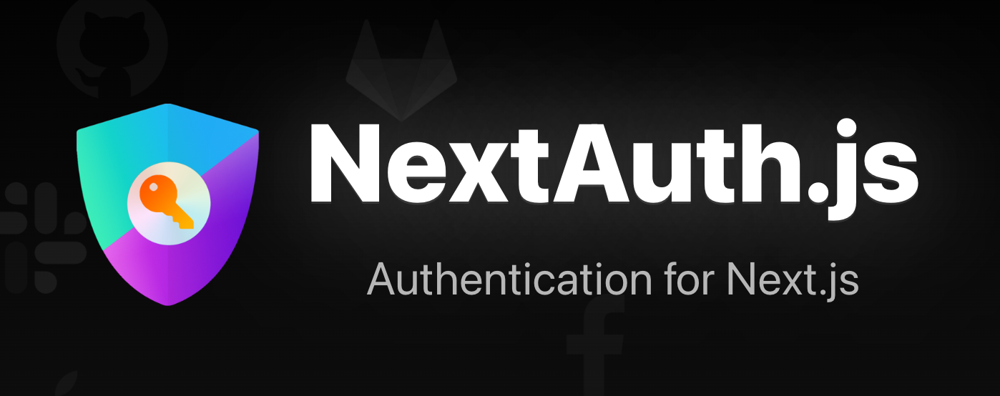

프로젝트를 진행하면서 OAuth의 **Authorization Code Grant** 방식으로 통합로그인을 구현하여야 했었다.
백엔드 동료가 Next Auth를 써보면 어떻겠냐고 물었고 마침 진행하던 프로젝트가 Next 기반이었기 때문에
보다쉽게 OAuth 기반 통합로그인을 구현 할 수 있었다.

통합로그인 구현을 완료하고나서 다음 주제로 NextAuth관련 포스팅을 해야지 라는 생각을 했었지만 역시나 조금 늦은것 같다,,  
아무튼 이번 포스팅에서는 NextAuth를 통한 권한관리, RefreshToken 및
권한별 라우팅 구현 경험을 소개하도록 하겠다. 기본적인 사용법은 [NextAuth 공식문서](https://next-auth.js.org/) 및 여러 다른 블로그에서
많이 소개가 되어있어서 건너뛰도록 하고 NextAuth의 작동방식, 토큰 재발급은 어떻게 하였는지, 권한별 라우팅 등에 초점을 맞춰서 글을 써보도록 하겠다.
이번 포스팅은 웬지 코드위주의 포스팅이 될거 같지만.. 그래도 누군가에겐 도움이 되었으면 좋겠다.

## Authorization Code Grant?

우선 OAuth의 **Authorization Code Grant** 방식이란 무엇인지 짚고 넘어가보자.  
Authorization Code Grant 방식은 리소스 접근을 위해 **Authorization Server**에서 받은 권한 코드로 리소스에 대한 액세스 토큰을 받는 방식을 말하며 NextAuth를 사용할시의
단계는 다음과 같다.

1. 사용자가 로그인 버튼을 클릭하면 **Authorization Server**에 권한부여 코드를 요청한다. 이때 `client_id`, `redirect_url`, `type` 를 파라미터에 추가해 요청하며 NextAuth 관련 다음과 같은 환경변수를 추가해주어야한다. 물론 Provider 마다 다른 정보가 필요할 수 있으므로 그 부분은 따로 넣어주자

```env
# NEXT Auth env
NEXTAUTH_URL=Next 서버 주소 (이 서버주소를 매개로 redirect url이 생성되므로 필수)
NEXTAUTH_SECRET=발급받은 ClientSecret
NEXTAUTH_CLIENT_ID=발급받은 ClientId
```

```js
/* KaKao Login 사용시 예시 */
export default NextAuth({
  providers: [
    KakaoProvider({
      clientId: process.env.NEXTAUTH_CLIENT_ID,
      clientSecret: process.env.NEXTAUTH_SECRET,
    }),
  ],
})
```

2. 사용자가 로그인을 완료 하면 **Authorization Server**가 파라미터의 `redirect_url`로 authorization code를 포함하여 리다이렉팅 시키며 NextAuth는 `client_id`, `client_secret`, `redirect_url` 및 받아온 `authorization code` 값을 파라미터로하여 **AccessToken**을 포함한 여러 계정정보를 받아온다.  
   이때 NextAuth에서 관리하는 Model중 하나인 `User Model`에 OAuth Profile (id, name, email, image) 정보가 저장되며 이는 Provider의 Profile 콜백을 통하여 확장할 수 있다.
   또한 `Account Model`에는 OAuth 계정에 관한 정보가 저장되며 일반적으로 리소스 서버에 요청을할때 필요한 **AccessToken**도 이에 포함된다.

```js
const oAuthProviders: Provider[] = [
  {
    //....생략
    profile(profile) {
      return {
        id: profile.sub,
        name: profile.name,
        email: profile.email,
        nickname: profile.nickname,
        birth: profile.brith,
        phone: profile.phone,
        gender: profile.gender,
      }
    },
  },
]
```

3. NextAuth 옵션 객체의 **callbacks**의 메소드들이 실행되며 이때 클라이언트 사이드 쪽에서 `useSession`을 통해 토큰의 정보 및 유저 정보를 가져가게 할 수 있게 하기 위해서
   초기로그인시 필요한 정보를 담아 NextAuth 내의 jwt 토큰을 만들어주고 세션에도 필요한 정보를 넘겨주자.  
   주의할점은 jwt메서드의 token은 Authorization Server에서 받아온 토큰을 뜻하는것이
   아니라는것이다. jwt메서드의 token은 NextAuth의 Account Models과 User Models를 정보를 조합하여 NextAuth에서 유지하는 토큰이다.
   Models에 관한 정보는 [NextAuth 공식문서](https://next-auth.js.org/adapters/models)에서 볼 수 있다.

```js
// NextAuth 옵션 지정 객체
const nextAuthOptions: NextAuthOptions = {
  providers: [...oAuthProviders],

  callbacks: {
    /**
     * JWT Callback
     * 웹 토큰이 실행 혹은 업데이트될때마다 콜백이 실행
     * 반환된 값은 암호화되어 쿠키에 저장됨
     */
    async jwt({ token, account, user }) {
      // 초기 로그인시 User 정보를 가공해 반환
      if (account && user) {
        return {
          accessToken: account.access_token,
          accessTokenExpires: account.expires_at,
          refreshToken: account.refresh_token,
          user,
        }
      }
      return token
    },

    /**
     * Session Callback
     * ClientSide에서 NextAuth에 세션을 체크할때마다 실행
     * 반환된 값은 useSession을 통해 ClientSide에서 사용할 수 있음
     * JWT 토큰의 정보를 Session에 유지 시킨다.
     */
    async session({ session, token }) {
      session.user = token.user as User
      session.accessToken = token.accessToken
      session.accessTokenExpires = token.accessTokenExpires
      session.error = token.error
      return session
    },
  },
}
```

## NextAuth의 Session

위의 단계에서 보았듯이 NextAuth는 `Account`, `UserProfile` 정보를 통하여 Session을 구성하며 개발자가 세션에 유지시킬 정보를 **callback** 의 `session` 메서드를 통하여
정할 수 있게 한다. 이렇게 세션을 유지시켜주면 ClientSide 에서는 다음과 같이 `useSession`을 통하여 세션정보를 확인 할 수 있다.

```js
import { useSession } from 'next-auth/react'

export default function Component() {
  const { data: session, status } = useSession()

  if (status === 'authenticated') {
    return <p>Signed in as {session.user.email}</p>
  }

  return <a href="/api/auth/signin">Sign in</a>
}
```

또한 NextAuth는 CSRF 공격을 방어하기 위해 CSRF Token(HttpOnly, host-only cookie 적용)을 사용한 **Double Submit Cookie** 검증을 수행한다.
더 자세한 NextAuth가 제공하는 엔드포인트를 알아보려면 [여기](https://next-auth.js.org/getting-started/rest-api)를 참고하면 좋을것 같다.

## NextAuth에서 AccessToken을 Refresh 하는법

NextAuth의 [Refresh Token Rotation](https://next-auth.js.org/tutorials/refresh-token-rotation) 문서를 보면 토큰을 Refresh 하는법이 친절하게 나와있지만
**공식문서는 accessToken이 만료된 이후에 리프레시**하는 방법으로 구현이 되어있었기 때문에 **권한 중단없이 slient하게 토큰을 리프레시 하고자** 했던 나는 다른 방법을 찾아야 했다.
다행이 NextAuth가 제공하는 SessionProvider의 `refetchInterval` props를 이용하여 세션을 명시적으로 refetch 할 수 있었기 때문에 이를 이용하여 다음과 같이 구현해보았다.

**첫번째로 NextAuth jwt callback을 통해 만료 10분전에 AccessToken을 리프레시 시킬 수 있게 하였다.**

```ts{19,20,21,22,23,24,25,26,27,28}
const nextAuthOptions: NextAuthOptions = {
  providers: [...oAuthProviders],
  callbacks: {
    /* JWT Callback */
    /* 웹 토큰이 실행 혹은 업데이트될때마다 콜백이 실행 */
    /* 반환된 값은 암호화되어 쿠키에 저장됨 */
    async jwt({ token, account, user }) {
      //초기 로그인시 User 정보를 가공해 반환
      if (account && user) {
        logger.info(`Login : ${user.email}`)
        return {
          accessToken: account.access_token,
          accessTokenExpires: account.expires_at,
          refreshToken: account.refresh_token,
          user,
        }
      }

      const nowTime = Math.round(Date.now() / 1000)
      const shouldRefreshTime =
        (token.accessTokenExpires as number) - 10 * 60 - nowTime

      // 토큰이 만료되지 않았을때는 원래사용하던 토큰을 반환
      if (shouldRefreshTime > 0) {
        return token
      }

      return refreshAccessToken(token)
    },

    async session({ session, token }) {
      session.user = token.user as User
      session.accessToken = token.accessToken
      session.accessTokenExpires = token.accessTokenExpires
      session.error = token.error
      return session
    },
  },
}

// AccessToken이 만료되면 refreshToken을 사용해서 다시 받아오는 함수
async function refreshAccessToken(token: JWT) {
  try {
    const url = '리프레시를 위한 End Point'

    const params = {
      grant_type: 'refresh_token',
      refresh_token: token.refreshToken,
    }

    const headers = {
      'Content-Type': 'application/x-www-form-urlencoded',
    }

    const res = await axios.post(url, null, {
      headers,
      params,
      auth: {
        username: process.env.CLIENT_ID as string,
        password: process.env.CLIENT_SECRET as string,
      },
    })

    const refreshedTokens = await res.data

    if (res.status !== 200) {
      throw refreshedTokens
    }

    return {
      ...token,
      accessToken: refreshedTokens.access_token,
      accessTokenExpires:
        Math.round(Date.now() / 1000) + refreshedTokens.expires_in,
      refreshToken: refreshedTokens.refresh_token ?? token.refreshToken,
    }

  } catch (err) {
    return {
      ...token,
      error: 'RefreshAccessTokenError',
    }
  }
}
```

이로써 웹 토큰이 실행 혹은 업데이트될때, **즉 Client Side에서 세션에 엑세스 할때마다** 토큰의 만료시간을 확인하고 만료 10분 전에 새로운 토큰을 받아올 수 있게 되었다.
다음 작업으로는 세션 엑세스 요청이 없더라도, 즉 사용자가 아무런 행동도 취하지 않더라도 Slient하게 토큰을 리프레시 할 수 있도록 Client Side에서 토큰 만료 5분전에
명시적으로 세션을 refetch 하도록 해보자.

```jsx
//_app.tsx
function _App({
  Component,
  pageProps: { session, ...pageProps },
  router: { route },
}: MyAppProps) {
  const [sessionRefetchInterval, setSessionRefetchInterval] = useState(10000)

  return (
    <SessionProvider
      session={pageProps.session}
      refetchInterval={sessionRefetchInterval}
    >
      ...생략
      <RefreshTokenHandler
        setSessionRefetchInterval={setSessionRefetchInterval}
      />
    </SessionProvider>
  )
}

export default _App
```

세션이 엑세스 토큰 만료 7분 전에 리페치 될 수 있도록 **RefreshTokenHandler** 컴포넌트를 이용하여 SessionProvider 적절한 Interval값을
가지게 해주었으며 적절한 **refetchInterval** 시간을 계산하는 RefreshTokenHandler 컴포넌트의 코드는 다음과 같다.

```jsx
import { useSession } from 'next-auth/react'
import { Dispatch, SetStateAction, useEffect } from 'react'

interface Props {
  setSessionRefetchInterval: Dispatch<SetStateAction<number>>
}

const RefreshTokenHandler = ({ setSessionRefetchInterval }: Props) => {
  const { data: session } = useSession()

  useEffect(() => {
    if (!!session) {
      const nowTime = Math.round(Date.now() / 1000)
      const timeRemaining =
        (session.accessTokenExpires as number) - 7 * 60 - nowTime
      setSessionRefetchInterval(timeRemaining > 0 ? timeRemaining : 0)
    }
  }, [session, setSessionRefetchInterval])

  return null
}

export default RefreshTokenHandler
```

이렇게 함으로서 전체적으로 봤을때는 엑세스 토큰 10분 전에 토큰을 재발급 가능한 상태가 되고
사용자가 아무런 행동을 취하지 않을 때는 자동적으로 토큰 만료 7분전에 Client Side에서 세션을 refetch 하므로 권한을 끊김 없이 유지 시킬 수 있게 되었다.

## NextAuth Session 정보를 통한 Private Route 구성하기

다음으로는 권한별 라우팅 구성이다. 권한이 없는 사용자가 권한을 요구하는 페이지에 접근을 못하도록 막아주어야 하므로 권한별 라우팅은 필수적이며
크게 세가지 방식인 ServerSide에서의 검증방법, ClientSide에서의 검증방법, Middleware를 통한 검증방법 있다.
이중 내가 사용해 본 두가지 방식의 권한별 라우팅 구성을 소개하겠다.

### ServerSide Securing pages

첫번째 방법으로는 Server Side에서 세션을 확인하는 방식이며 `getServerSideProps`를 감싸는 고차함수로 이를 구현해 보았다.

```ts
import { getSession } from 'next-auth/react'
import { GetServerSideProps, Redirect } from 'next'
import { GetServerSidePropsContext } from 'next'

const defaultGssp = async () => {
  return {
    props: {},
  }
}

interface GsspData {
  props?: any
  redirect?: Redirect
  notFound?: true
}

export const withAuth = (gssp: GetServerSideProps = defaultGssp) => {
  return async (ctx: GetServerSidePropsContext) => {
    const session = await getSession(ctx)

    //권한이 없을경우 Redirect 시킴
    if (session === null) {
      return {
        redirect: {
          destination: '/',
        },
      }
    }

    //세션이 있을 경우 전달된 getServerSideProps 함수를 실행
    const gsspData: GsspData = await gssp(ctx)

    return {
      props: {
        ...gsspData.props,
      },
    }
  }
}
```

`getServerSideProps`를 감싸는 고차함수가 세션에 접근하여 권한을 확인하고 권한이 없을 경우에는 리다이렉트 시킨다.
최신 업데이트 사항으로는 Server Side에서 `getSession`을 사용하는 대신 [unstable_getServerSession](https://next-auth.js.org/configuration/nextjs#unstable_getserversession)를 사용하는 것이 성능상 이점이 있다고 하니 참고해보면 좋을 것 같다.

이렇게 만들어진 withAuth 고차함수를 통해 다음과 같이 Private Page로 설정 할 수 있다.

```ts
const PrivatePage = () => {
  return 'Is Private Page'
}
export default PrivatePage

export const getServerSideProps = withAuth()
//or
export const getServerSideProps = withAuth(async (ctx) => {
  //...do something
})
```

### ClientSide Securing pages

다음은 Client Side에서 검증을 하는 방법으로 권한이 필요한 페이지일 경우 **AuthContainer** 라는 권한을 검증하는 컴포넌트로 감싸주는 방식이다.
Client Side 검증방식은 path 및 role 기반을 통해 보다 체계적으로 검사하기 유리하기 때문에 나는 이 방식으로 Private Route를 구성중이다.

```tsx{62}
//_app.tsx
export interface AuthInfo {
  role?: 'admin' | 'member'
  loading?: React.ReactNode
  redirect?: string
}

interface AuthEnabledComponentConfig {
  auth: AuthInfo
}

type NextComponentWithAuth = NextComponentType<NextPageContext, any, {}> &
  Partial<AuthEnabledComponentConfig>

interface MyAppProps extends AppProps {
  Component: NextComponentWithAuth
}

//일반 유저 권한이 필요한 start path
const ALLOWED_ONLY_TO_MEMBERS = ['/media', '/test']
//어드민 유저 권한이 필요한 start path
const ALLOWED_ONLY_TO_ADMIN = ['']

function MyApp({
  Component,
  pageProps: { session, ...pageProps },
  router: { route },
}: MyAppProps) {
  const [queryClient] = useState(() => new QueryClient())
  const [sessionRefetchInterval, setSessionRefetchInterval] = useState(10000)

  //path를 검사하여 AuthContainer로 감쌀지 여부를 결정
  const memberRequireAuth = ALLOWED_ONLY_TO_MEMBERS.some((path) =>
    route.startsWith(path)
  )

  const renderAuthorizedComponent = () => {
    if (memberRequireAuth) {
      const authInfo: AuthInfo = {
        role: 'member',
        redirect: Component.auth?.redirect,
        loading: Component.auth?.loading,
      }
      return (
        <AuthContainer authInfo={authInfo}>
          <Component {...pageProps} />
        </AuthContainer>
      )
    }
    return <Component {...pageProps} />
  }

  return (
    <SessionProvider
      session={pageProps.session}
      refetchInterval={sessionRefetchInterval}
    >
      <QueryClientProvider client={queryClient}>
        <ThemeProvider theme={defaultTheme}>
          <Hydrate state={pageProps.dehydratedState}>
            <GlobalStyle />
            {renderAuthorizedComponent()}
          </Hydrate>
        </ThemeProvider>
        <ReactQueryDevtools initialIsOpen={false} />
      </QueryClientProvider>
      <RefreshTokenHandler
        setSessionRefetchInterval={setSessionRefetchInterval}
      />
    </SessionProvider>
  )
}

export default MyApp
```

사용한 `<AuthContainer>` 컴포넌트는 Session을 확인하여 접근가능 여부를 결정하는 컴포넌트로 다음과 같다.

```tsx
import React, { useEffect } from 'react'
import { useSession } from 'next-auth/react'
import { useRouter } from 'next/router'
import { AuthInfo } from '@pages/_app.page'

interface Props {
  children: any
  authInfo: AuthInfo
}

const AuthContainer = ({ children, authInfo }: Props) => {
  const router = useRouter()
  const { data: session, status } = useSession()
  const isUser = !!session?.user

  const redirect = authInfo?.redirect || '/'
  const role = authInfo.role
  const loading = authInfo?.loading || <div>Loading</div>

  useEffect(() => {
    if (status === 'loading') return
    if (!isUser) {
      router.push(redirect)
    }
  }, [isUser, status])

  if (isUser) {
    return children
  }

  return loading
}

export default AuthContainer
```

위와 같은 방법을 사용할 경우 페이지마다 다른 Redirect 및 Loading fallback을 아래와 같이 쉽게 설정할 수 있다.

```tsx
const PrivatePage = () => {
  return 'Is Private Page'
}

PrivatePage.auth = {
  loading: <div>another loading</div>,
  redirect: '/another-path',
}

export default PrivatePage
```

## 마치며,,

NextAuth를 사용하여 OAuth 기반 권한관리를 구현해본 결과 상당히 편했다. 개발자가 직접 구현해야 했던 많은 기능들을 제공해주며 NextAuth 옵션 객체의 callbacks 메서드를 통하여
손쉽게 커스터마이징 및 확장 할 수 있었다.  
처음 NextAuth를 사용해보는지라 나도 여러 포스팅 및 문서를 참고하여 코드를 작성하였기 더 효율적인 방법이 있을 수 있다는 것을 알아주었으면 좋겠고 틀린 부분이나 더 궁금한 부분은 댓글을
남겨주면 바로 찾아서 수정 및 답편 하도록 하겠다.  
요즘 드는 생각이지만 프론트엔드 개발쪽은 끊임없이 새로운 라이브러리, 프레임워크 등 신기술이 등장하는 것 같다. 물론 트렌드를 따라가는 것만이 옳다고는 할 수 없지만 그래도 꾸준히 공부하여 지식을 채워야한다는 것은 변하지 않기에 더욱 노력해보고자 한다.
