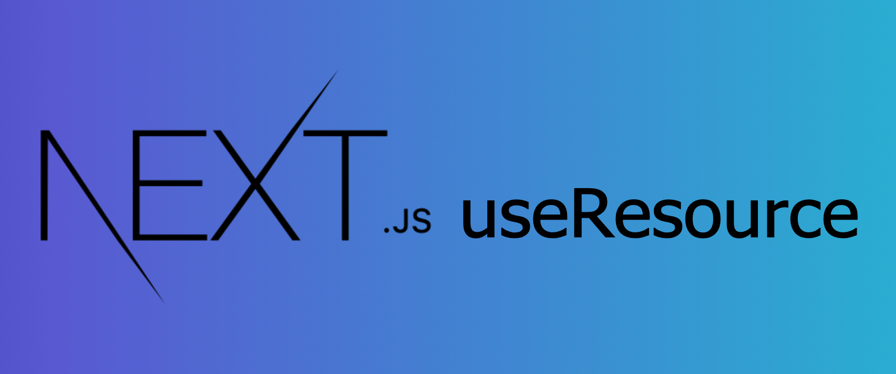

현재 현업에서 사수가 없이 개발을 진행하고 있기때문에 여러 액션, 아이디어, 기술정보 등을 다른 현직 개발자의 블로그나 혹은 기업의 기술블로그 및 컨퍼런스 등에서
얻는 편이다. 최근 Toss의 SLASH22 개발자 컨퍼런스가 개최되어서 여러 영상을 보고있던 중 [잃어버린 유저의 시간을 찾아서 : 100년을 아껴준 SSR 이야기](https://toss.im/slash-22/sessions/1-5)
에 나온 Next프레임워크에서의 Props drilling문제를 해결하기 위한 `useResource` Hook이 흥미로웠어서 직접 구현해 보기로 했다. 영상에서는 세부 구현 방법은 나와있지 않아서 살짝의 뇌피셜?을 추가해 기본 기능만을 구현해 보기로 했다.

# Next에서의 Props Drilling 문제

`useResource`훅이 무슨역할을 하는지 알아보기 전에 먼저 **Props drilling 문제**가 무엇인지 알아보자.
Props drilling이란 컴포넌트가 자신의 관심사와는 상관없는 데이터를 오직 하위의 컴포넌트로만 전달하기 위해 유지하는 문제점이다.
Next 프레임워크를 사용하다보면 아래 코드와 같이 SSR을 위해 `getServerSideProps`을 사용하는데 `getServerSideProps`은 Page컴포넌트에서만 사용할 수 있기때문에
어쩔 수 없이 하위 컴포넌트로의 Props Drilling이 계속 일어나게 된다.

```jsx
import React from 'react'
import { GetServerSideProps } from 'next'

interface PageProps {
  forMe: string
  forA: number
  forB: number[]
}

const ComponentB = ({ forB }: Omit<PageProps, 'forMe' | 'forA'>) => {
  //PageComponent -> ComponentA를 타고온 Props:forB
  return <div>{forB}</div>
}

const ComponentA = ({ forA, forB }: Omit<PageProps, 'forMe'>) => {
  return (
    <section>
      {forA}
      <ComponentB forB={forB} />
    </section>
  )
}

const PageComponent = ({ forMe, ...rest }: PageProps) => {
  return (
    <main>
      <h1>{forMe}</h1>
      <ComponentA {...rest} />
    </main>
  )
}

export const getServerSideProps: GetServerSideProps<PageProps> = async () => {
  return {
    props: {
      forMe: 'Props for me!',
      forA: 1,
      forB: [1, 2],
    },
  }
}

export default PageComponent
```

물론 Props drilling이 항상 나쁜것은 아니다.
작은 어플리케이션일 경우에는 가장 상위의 컴포넌트가 Props drilling를 위한 상태를 유지하고있기 때문에 데이터의 흐름을 쉽게 파악할 수 있는 장점이 있다. 하지만
**어플리케이션의 규모가 커질수록 컴포넌트의 수가 많아지고 그 의존관계의 수도 많아지므로** Props drilling 과정에서 필요하지 않은 Props가 남거나 이름이 변경되어 전달되면서
코드가 복잡해질수 있다.

# React Query의 Dehydrate

Next 프레임워크의 SSR사용시 어쩔수 없이 발생하는 위와같은 Props drilling 문제를 해결하기 위한 방법은 대표적으로 ContextAPI나 Recoil를 사용하여 전역 상태를 유지하여 해결할 수 있지만 CSR에서 React Query를 사용하고 있다면
**React Query의 `Dehydrate`를 이용해 SSR과 CSR의 페칭 데이터를 자연스럽게 연결시킬수 있다.**
SLASH22 영상에서는 따로 react query의 `Dehydrate`를 사용한다고
명시하지는 않고 세부 코드도 나오지 않았지만 영상에나온 코드 흐름을 보았을때 `Dehydrate`를 사용하는 방식인것 같았다.

```jsx
// _app.jsx
import {
  Hydrate,
  QueryClient,
  QueryClientProvider,
} from '@tanstack/react-query'

export default function MyApp({ Component, pageProps }) {
  const [queryClient] = React.useState(() => new QueryClient())

  return (
    <QueryClientProvider client={queryClient}>
      <Hydrate state={pageProps.dehydratedState}>
        <Component {...pageProps} />
      </Hydrate>
    </QueryClientProvider>
  )
}
```

```jsx
//page component
import { dehydrate, QueryClient, useQuery } from '@tanstack/react-query'

export async function getStaticProps() {
  const queryClient = new QueryClient()

  await queryClient.prefetchQuery(['posts'], getPosts)

  return {
    props: {
      dehydratedState: dehydrate(queryClient),
    },
  }
}

function Posts() {
  const { data } = useQuery(['posts'], getPosts)
  // ...
}
```

위와같이 `getServerSideProps`를 사용한 SSR 환경에서 미리 데이터 페칭을 수행하여 캐시가 포함되어있는 queryClient를
`Dehydrate`하여 Page컴포넌트의 Props로 전달하고 다시 `Hydrate`하여 서버가 페이지 컴포넌트를 로드할시에 **페칭된 데이터가 포함된 마크업을 pre-rendering**할 수 있게 한다.
더 자세한 내용은 [react-query](https://tanstack.com/query/v4/docs/guides/ssr) 공식문서를 참고하자.

# Next app.js에서의 getInitialProps 활용

매 페이지마다 SSR시 필요한 리소스를 받아오기위해 `getServerSideProps`를 추가하는것은 귀찮은 일이다. 이럴때는
Next의 `_app.index`에서 `getInitialProps` 사용하여 공통적으로 처리 해줄수 있다.  
주의 할 점은 Next의 **Server Side Cycle은 `_app.tsx의 getInitialProps` -> `Page Component의 getInitialProps`의**
**순서로 실행되며**, 한 페이지를 로드할 때 하나의 `getInitialProps`만 실행되기 때문에 랜더링 하고자 하는 Page컴포넌트의 initialProps의 결과도
합쳐주어야 한다는것을 명심하자.

또한 Next는 `_app.js`에서 `getInitialProp`s를 사용할 시 **Automatic Static Optimization의 기능이 사용불가능**해지기 때문에 사용하지 말 것을 권장하고 있다.
Automatic Static Optimization이란 Next 프레임워크가 빌드시에 Page 컴포넌트에 `getInitialProps` 또는 `getServerSideProps`가 없을 때 해당 페이지를 static 페이지라고 인식하여 html 파일로 만드는 것으로 `_app.js`에서 `getInitialProps`를 사용할 시 어떠한 페이지도 static page로 인식되지 않기때문에 모든 페이지가 SSR로 구동하게 된다.

`_app.js`의 `getInitialProps`은 렌더링할 Component를 아래와 같이 받아올 수 있기 때문에
SSR시 데이터 페칭이 필요한 컴포넌트인지 확인하고 필요할 경우 react query의 `queryClient.fetchQuery` 를 사용하여
미리 fetching 할 수 있다.

```jsx
MyApp.getInitialProps = async ({ Component, ctx }: MyAppContext) => {
  let pageProps = {}
  if (Component.getInitialProps) {
    pageProps = await Component.getInitialProps(ctx)
  }

  const { requiredResource } = Component
  if (!requiredResource) return { pageProps }

  const queryClient = new QueryClient()

  await Promise.all(
    requiredResource.map(async (resource: any) =>
      queryClient.fetchQuery(resource.key, resource.fetcher)
    )
  )

  pageProps = { ...pageProps, dehydratedState: dehydrate(queryClient) }
  return { pageProps }
}
```

`_app.js`를 위와같이 구성하였으면 SSR시 리소스가 필요한 페이지 컴포넌트는 아래와 같이 정의 할 수 있다.
SLASS22 컨퍼런스 영상에서 `createResource` 함수를 이용해 리소스를 정의 하였는데 세부구현은 나와있지 않아서 나는 일단
가장 간단한 기본 형태로 구현해 보았다.

```ts
interface TestData {
  userId: string
  id: string
  title: string
  completed: boolean
}

const fetchTestData = async (): Promise<TestData> => {
  const res = await fetch('https://jsonplaceholder.typicode.com/todos/1')
  return res.json()
}
const fetchTestData2 = async (): Promise<TestData> => {
  const res = await fetch('https://jsonplaceholder.typicode.com/todos/2')
  return res.json()
}

type CreateResource = <T>(resource: {
  key: string | readonly unknown[]
  fetcher: () => Promise<T>
}) => typeof resource

//리소스 생성 함수
const createResource: CreateResource = (resource) => {
  return resource
}

//해당 페이지의 SSR시 사용할 resource를 정의한다.
const resource1 = createResource({
  key: 'testFetch',
  fetcher: async () => fetchTestData(),
})

const resource2 = createResource({
  key: 'testFetch2',
  fetcher: async () => fetchTestData2(),
})

const Landing = () => {
  return (
    <>
      <h2>useResource</h2>
      <Component1 />
      <Component2 />
    </>
  )
}

//해당 컴포넌트가 사용할 리소스목록을 프로퍼티로 추가한다.
Landing.requiredResource = [resource1, resource2]
```

# useResource hook

위와 같은 작업이 끝났다면 이제 `useResource` hook을 만들어서 Page컴포넌트의 하위 컴포넌트들이 react-query가
캐싱한 리소스를 가져올 수 있도록 해보자. `useResource` hook은 내부적으로 react-query의 `useQuery`를 사용하여
리소스를 반환한다. 원래 useQuery 결과의 data의 타입은 `TData | undefined` 이지만 `useResource`가 내부적으로 `useQuery`를 사용하여 반환한 data는 항상
`TData` 타입을 가지기 때문에 타입 단언을 사용해 캐스팅 해주었다.

```ts
// useResource.ts
import { useQuery } from 'react-query'
const useResource = <T>(resource: {
  key: string | readonly unknown[]
  fetcher: () => Promise<T>
}) => {
  const { data, ...useQueryResults } = useQuery(resource.key, resource.fetcher)
  return {
    data: data as T,
    ...useQueryResults,
  }
}

export default useResource
```

구현한 `useResource`는 다음과 같이 `createResource`로 만든 resource를 인자로 넣어서 사용한다.
**결과적으로 SSR를 위한 Props drilling 없이 각 컴포넌트에서 리소스를 참조**할 수 있게 되었다.

```js
function Component1() {
  const { data } = useResource(resource1)
  return <p>{data.title}</p>
}

function Component2() {
  const { data, isLoading } = useResource(resource2)
  if (isLoading) {
    return <p>Loading...</p>
  }
  return <p>{data.title}</p>
}
```

# 마치며..

지금까지 구현해본 `useResource`는 가장 기본 기능만을 구현했으므로 바로 현업에서 쓰기에는 무리가 있다. `useQuery`의 `key`가 동적으로 변화될수 있는 경우(페이지네이션 등)에서의
케이스를 맞춰줄 필요가 있어보이기 때문이다.  
SLASH22에 소개된 자료에서도 세부구현은 나오지 않아서 정확히는 알 수 없지만 본 포스팅에서 구현한 `useResource` hook에 추가적으로 필요한 기능을 생각해보자면 **에러핸들링 기능 및** **`useQuery`옵션을 지정하는 기능도 구현이 필요해 보인다.**
그렇기에 단지 **어떠한 매커니즘으로 SSR환경에서 Props drilling 없이 컴포넌트에 리소스가 도달**하는지만 봐주면 좋을 것 같다.
