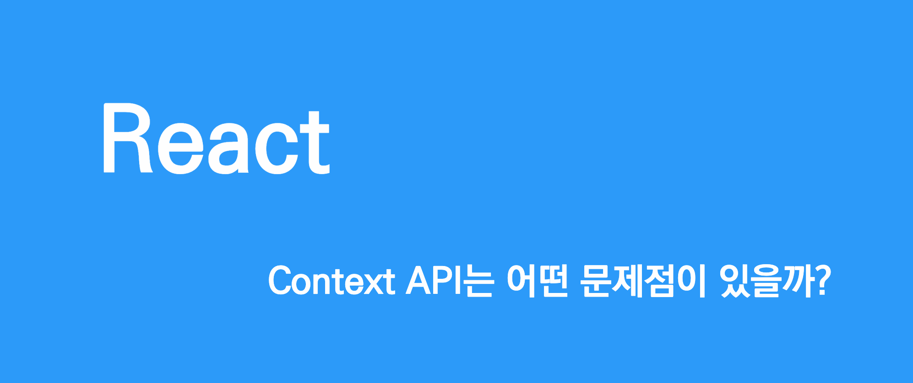

이전까지 단순히 **"ContextAPI에는 이슈가 있다."** 라고만 생각하며 ContextAPI 사용을 회피해 왔었다.  
하지만 최근에 Context API를 사용해야 할 경우가 있었으며, 그 경험을 토대로 어떻게 ContextAPI의 이슈를 회피 할 수 있는지 정리해보고자 한다.

## ContextAPI란?

먼저 ContextAPI가 무었인지 부터 알아보자.
ContextAPI란 props를 부모에서 자식으로 넘겨주지 않고도 컴포넌트 트리 전체에 데이터를 제공할 수 있는 React의 내장된 기능이다.

```tsx
type ContextState = {
  value: number
  setValue: Dispatch<SetStateAction<number>>
}

const contextInitialValue: ContextState = {
  value: 0,
  setValue: () => {},
}

const Context = createContext<ContextState>(contextInitialValue)

function ContextExampleComponent() {
  const [value, setValue] = useState<number>(0)

  return (
    <Context.Provider value={{ value, setValue }}>
      {....}
    </Context.Provider>
  )
}
```

위 코드는 간단한 Context 구성 코드이며 createContext를 이용하여 Context를 생성하고
Provider를 선언하여 하위 컴포넌트들이 context value를 소비 할 수 있게 해준다.

## ContextAPI의 리렌더링 이슈

ContextAPI를 사용하기 위해 조금만 검색해봐도 ContextAPI에 리렌더링 이슈가 있다는 것을 알게된다.  
이러한 리렌더링 이슈를 극복하기 위해 크게 두가지 관점으로 접근해 보았으며 해결 방법을 공유해보고자 한다.

### Provider로 감싸진 모든 컴포넌트들이 리렌더링 된다?

```tsx
type ContextState = {
  value: number
  setValue: Dispatch<SetStateAction<number>>
}

const contextInitialValue: ContextState = {
  value: 0,
  setValue: () => {},
}

const Context = createContext<ContextState>(contextInitialValue)

function ContextExampleComponent() {
  const [value, setValue] = useState<number>(0)

  return (
    <Context.Provider value={{ value, setValue }}>
      <ChildComponent>
        <LeafChildComponent />
      </ChildComponent>
      <OtherChildComponent />
    </Context.Provider>
  )
}

function OtherChildComponent() {
  console.log('ChildComponent Render')
  return <></>
}

function ChildComponent({ children }: WithChildren) {
  console.log('ChildComponent Render')
  return <div>{children}</div>
}

function LeafChildComponent() {
  const { setValue } = useContext(Context)

  console.log('LeafChildComponent Render')
  return (
    <div>
      LeafChildComponent
      <button onClick={() => setValue((prevState) => prevState + 1)}>+</button>
    </div>
  )
}

export default ContextExampleComponent
```

### Children을 통한 Rerendering 회피하기

```tsx
// ...생략

function ContextExampleComponent({ children }: WithChildren) {
  const [value, setValue] = useState<number>(0)

  return (
    <Context.Provider value={{ value, setValue }}>{children}</Context.Provider>
  )
}

export function ChildComponent({ children }: WithChildren) {
  console.log('ChildComponent Render')
  return <div>{children}</div>
}

export function LeafChildComponent() {
  const { setValue } = useContext(Context)
  console.log('LeafChildComponent Render')

  return (
    <div>
      LeafChildComponent
      <button onClick={() => setValue((prevState) => prevState + 1)}>+</button>
    </div>
  )
}

export default ContextExampleComponent
```

```tsx
function LandingPage() {
  return (
    <ContextExampleComponent>
      <ChildComponent>
        <LeafChildComponent />
      </ChildComponent>
    </ContextExampleComponent>
  )
}
```

**children을 이용하여 회피 가능한 이유가 무엇일까?**

### Context를 소비하는 컴포넌트들이 모두 리렌더링 된다?

```tsx
export function ChildComponent({ children }: WithChildren) {
  const { value } = useContext(Context)

  console.log('ChildComponent Render')
  return (
    <div>
      <div>{value}</div>
      <div>{children}</div>
    </div>
  )
}
```

### Provider를 분리하여 Rerendering 회피하기

```tsx
// ...생략

const Context = createContext<ContextState['value']>(0)
const DispatchContext = createContext<ContextState['setValue']>(() => {})

function ContextExampleComponent({ children }: WithChildren) {
  const [value, setValue] = useState<number>(0)

  return (
    <Context.Provider value={value}>
      <DispatchContext.Provider value={setValue}>
        {children}
      </DispatchContext.Provider>
    </Context.Provider>
  )
}

export function ChildComponent({ children }: WithChildren) {
  const value = useContext(Context)
  console.log('ChildComponent Render')
  return (
    <div>
      <div>number:{value}</div>
      <div>{children}</div>
    </div>
  )
}

export function LeafChildComponent() {
  const setValue = useContext(DispatchContext)
  console.log('LeafChildComponent Render')

  return (
    <div>
      LeafChildComponent
      <button onClick={() => setValue((prevState) => prevState + 1)}>+</button>
    </div>
  )
}

export default ContextExampleComponent
```
