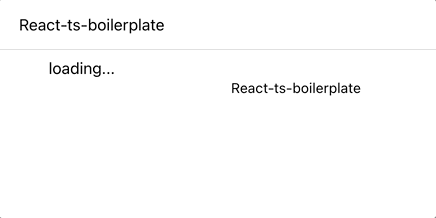
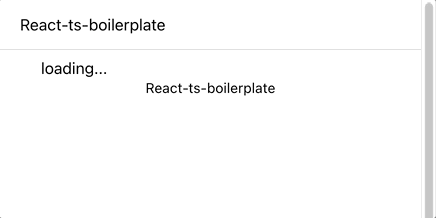

지금까지 개발을 해오면서 에러처리에 큰 고민을 가지지 않았던 것 같다. 대부분 서버의 응답을 받는 해당 컴포넌트에서
명령형으로 처리하였기 때문에 깔끔하지 못한 코드였었다. 물론 명령형 처리가 나쁜것도 아니고 무조건 선언형으로 에러를 처리하는것이
옳지 않은 상황이 있을 수 있다. 두 가지 방법에 열린 시각으로 접근하는게 맞다고 생각하며 이번 포스트에서는 React Suspense와 ErrorBoundary를 이용하여
제작중인 boilerplate에 적용한 컴포넌트들을 소개해보고자 한다.

## 1. ErrorBoundary

[ErrorBoundary](https://reactjs.org/docs/error-boundaries.html)란 하위 컴포넌트 트리의 에러를 기록하며 에러가 발생된 컴포넌트 트리 대신 Fallback UI를 보여주는  
React 컴포넌트 이다. 리엑트 공식문서에도 잘 나와있듯 클래스형 컴포넌트를 통하여 구현할 수 있으며 생명주기 메서드인 `static getDerivedStateFromError()` 와 `componentDidCatch()`를 사용하며 기본 코드는 아래와 같다.

```jsx
class ErrorBoundary extends React.Component {
  constructor(props) {
    super(props)
    this.state = { hasError: false }
  }

  static getDerivedStateFromError(error) {
    return { hasError: true }
  }

  componentDidCatch(error, errorInfo) {
    logErrorToMyService(error, errorInfo)
  }

  render() {
    if (this.state.hasError) {
      return <h1>Something went wrong.</h1>
    }
    return this.props.children
  }
}
```

`static getDerivedStateFromError()`는 render단계에서 호출되며 fallback UI를 나타내기위해 상태값을 변경하는 용도로 쓴다.  
`componentDidCatch()`는 보통 에러를 기록하는데 쓰이며 부수효과 발생을 허용한다.  
또한 ErrorBoundary가 **에러 메시지를 렌더링하는 데에 실패**한다면 **에러는 그 위의 가장 가까운 에러 경계로 전파**된다.
즉 위의 코드에 ignoreCase를 추가하여 무시해야할 에러일 경우 Fallback UI대신 그대로 children을 return하면 무시된 에러를 가장 가까운 상위의 ErrorBoundary로 전파시킬 수 있다.

잘 짜여진 ErrorBoundary를 제공하는 라이브러리도 많지만 공부겸 직접 내 입맛대로 맞게 수정해 보았다.

```tsx{2,3,4,5,39}
interface Props {
  children: ReactNode
  fallback: ReactElement
  ignoreError?: Set<CustomErrorClass>
  resetQuery?: () => void
}

interface State {
  hasError: boolean
  error: Error | null
}

const initialState: State = { hasError: false, error: null }

class ErrorBoundary extends Component<Props, State> {
  constructor(props: Props) {
    super(props)
    this.state = initialState
  }

  static getDerivedStateFromError(error: Error): State {
    return { hasError: true, error: error }
  }

  resetBoundary = () => {
    this.props.resetQuery?.()
    this.setState(initialState)
  }

  componentDidCatch(error: Error, errorInfo: ErrorInfo) {}

  isIgnoreError() {
    return this.props.ignoreError?.has(
      this.state.error?.constructor as CustomErrorClass
    )
  }

  render() {
    if (this.state.hasError && !this.isIgnoreError()) {
      return cloneElement(this.props.fallback, {
        resetBoundary: this.resetBoundary,
        error: this.state.error,
      })
    }
    return this.props.children
  }
}

export default ErrorBoundary
```

Props로 children과 fallback 컴포넌트를 받도록 하였고 ignoreError Set을 받아서 해당 에러를 상위로 전파 시킬수 있게 하였다.
Props로 받은 resetQuery의 용도는 **react-query에 캐싱된 에러를 ErrorBoundary가 명시적으로 reset되는 시점에 캐싱된 error도 reset**시켜주기 위하여
해당함수를 받을 수 있게 하였다. 해당내용은 아래에서 추가로 설명하겠다.

## 2. QueryBoundary

Server State를 관리하는 라이브러리로 react-query를 사용중이었기 때문에 react-query 에러 캐싱을 초기화를 위한 함수를 전달하며
위에서 만든 ErrorBoundary와 Suspense를 감싸 api 요청시에 에러 및 로딩핸들링으로 사용할 QueryBoundary라는 고차 컴포넌트를 만들었다.

```tsx{8,16,18}
interface Props {
  children: ReactNode
  loadingFallback?: ReactElement
  errorFallback?: ReactElement
  ignoreError?: CustomErrorClass[]
}

const defaultIgnoreError: CustomErrorClass[] = [UnauthorizedError]

const QueryBoundary = ({
  children,
  loadingFallback,
  errorFallback,
  ignoreError = [],
}: Props) => {
  const { reset } = useQueryErrorResetBoundary()
  return (
    <ErrorBoundary
 fallback={errorFallback || <DefaultErrorFallBack />}
      ignoreError={new Set([...defaultIgnoreError, ...ignoreError])}
      resetQuery={reset}
    >
      <Suspense fallback={loadingFallback || <></>}>{children}</Suspense>
    </ErrorBoundary>
  )
}

export default QueryBoundary
```

보통 Unauthorized(401)에러일 경우에는 로그인화면으로 이동시킨다. 그래서 에러를 전파시켜 가장 상위의 ErrorBoundary에서 처리하고자 하였고
그 이유로 defaultIgnoreError에 UnauthorizedError를 추가해 주었다. 또한 react-query의 hook인 useQueryErrorResetBoundary()를 이용해
reset 함수를 얻어와 ErrorBoundary에 넘겨주었다 이로써 이reset 함수는 ErrorBoundary가 렌더링하는 Fallback UI에 전달되어 react-query의 캐싱된 error도 초기화 해줄 수 있게 되었다.

## 3. DefaultErrorFallback

위에서 사용된 DefaultErrorFallback은 ErrorBoundary로부터 넘겨받은 resetBoundary Props를 통하여 에러가 생겼을때 재시도 할 수 있게 하였다.
재시도 버튼을 눌러 resetBoundary가 실행되면 ErrorBoundary의 상태가 초기화 되며 re-render가 발생하여 하위의 자식 컴포넌트도 re-render되어
api 요청을 다시 수행한다.

```tsx
interface Props {
  resetBoundary?: () => void
}

const DefaultErrorFallBack = ({ resetBoundary }: Props) => {
  return (
    <div>
      <div>기본 쿼리 FallBack</div>
      <button onClick={resetBoundary}>재시도</button>
    </div>
  )
}

export default DefaultErrorFallBack
```

## 4. Retry Test

그럼 이제 지금까지 만든 에러 헨들링 기능을 테스트해보자. 테스트를 위해 간단한 서버측 코드를 작성하였다.
두번째 요청부터 200번대 응답을 주도록 하였다.

```js
const cors = require('cors')
const express = require('express')
const app = express()
app.use(cors())
app.listen(4000, function () {
  console.log('start! express server on port 4000')
})

let count = 0
const wait = () => new Promise((res) => setTimeout(res, 1500))

app.get('/', async function (req, res) {
  console.log('req')
  await wait()
  if (count === 0) {
    res.status(500).json({ name: 'jeongyun' })
    count = 1
  } else {
    res.status(200).json({ name: 'jeongyun' })
  }
})
```

클라이언트 측 코드는 다음과 같으며 react-query를 사용하는 비동기 컴포넌트를 QueryBoundary로 감싸주었다.

```tsx
(...)생략
const Test = () => {
  const { data } = useQuery('query', () => api.userService.getUserInfo(), {
    suspense: true,
    retry: false,
  })
  return <div>{data.star}</div>
}

const Home = ({}: HomeProps) => {
  return (
    <>
      <QueryBoundary loadingFallback={<>loading...</>}>
        <StDiv>
          <Test />
        </StDiv>
      </QueryBoundary>
    </>
  )
}
```

### Result



loadingFallback UI를 확인할 수 있으며 첫번째 요청시 발생한 Error가 Catch되어 DefaultErrorFallback UI가
렌더링되고 DefaultErrorFallback 의 재시도 버튼을 눌러 ErrorBoundary와 react-query의 캐싱 데이터를 초기화 시켜
재시도 하여 두번째 요청에서는 정상적인 응답을 렌더링하는것을 볼 수 있다.

## 5. GlobalErrorFallback

위에서 테스트한 QueryBoundary는 401에러는 무시하도록 하였다. 무시되어 상위로 전파된 모든 에러는 가장 상위의 ErrorBoundary가
Catch하도록 하고 에러정보를 GlobalErrorFallback에 전달하여 처리해보도록 하자.

```tsx
import React from 'react'
import { NotFoundError, UnauthorizedError } from '@api/types/error'

interface Props {
  error?: Error
}
const GlobalErrorFallBack = ({ error }: Props) => {
  let render = null
  ;(function () {
    switch (error?.constructor) {
      case UnauthorizedError:
        window.location.href = './login?expire'
        break
      case NotFoundError:
        render = <div>404 Error</div>
        break
    }
  })()
  return <>{render}</>
}

export default GlobalErrorFallBack
```

GlobalErrorFallback의 코드는 위와같으며 에러의 종류를 파악하여 해당 에러에 맞는 처리를 가능하게 하였다.  
작성한 위 Fallback를 가장상위의 ErrorBoundary에 전달해 주었다. 나와같은 경우엔 아래처럼 Routes를 감싸주었다.

```tsx
const Router = () => {
  return (
    <>
      <Suspense fallback={<></>}>
        <ErrorBoundary fallback={<GlobalErrorFallBack />}>
          <Routes>
            <Route path="/" element={<Home />} />
            <Route path="/login" element={<Login />} />
          </Routes>
        </ErrorBoundary>
      </Suspense>
    </>
  )
}
```

## 6. UnauthorizedError Catch Test

방금적용한 컴포넌트가 잘 작동하는지 확인해 보자 잘 작동한다면 UnauthorizedError발생시 **QueryBoundary는 UnauthorizedError를 무시하고 전역에서 Catch되어
로그인 페이지로 이동**될 것이다. 서버측에서 401을 응답하도록 수정한뒤 테스트해보았다.

### Result



성공적으로 로그인페이지로 리다이렉팅 되는것을 확인할 수 있다.

## 마치며..

선언적으로 비동기 에러를 핸들링 하기위해 알아야할 것들이 꽤 많았기 때문에 구현을 하면서 조금 해맸던 것 같다. 쓸일이 없을 줄 알았던 클래스형 컴포넌트도 이번에
작성해보며 다시금 중요성을 깨달았으며 리엑트 라이프 사이클에 대해 아직도 내가 공부해야할 것들이 많이 남았구나 라는 생각도 들었다.. 역시 공부는 끝이 없는 것 같다.  
항상 내가 작성한 코드가 정답이 아닐수 있다는 생각을 가지며 개발을 한다. 같은 기능을 하더라도 더 깔끔하고 나은 방법이 있을 것이라고 생각한다.
하지만 역시 부딪혀보지 않으면 모르기에 내가 직접 구현을 해보려고 노력하는 편이다. 선언적 에러 핸들링으로는 Event handler와 SSR에서의 에러를 Catch하지 못하기 때문에
또 이에 대응할 수 있는 방법을 찾으며 더 공부해봐야겠다.
