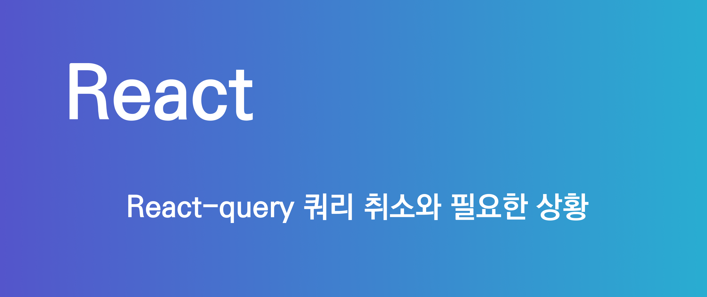
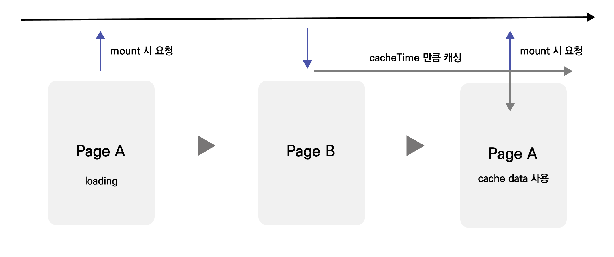
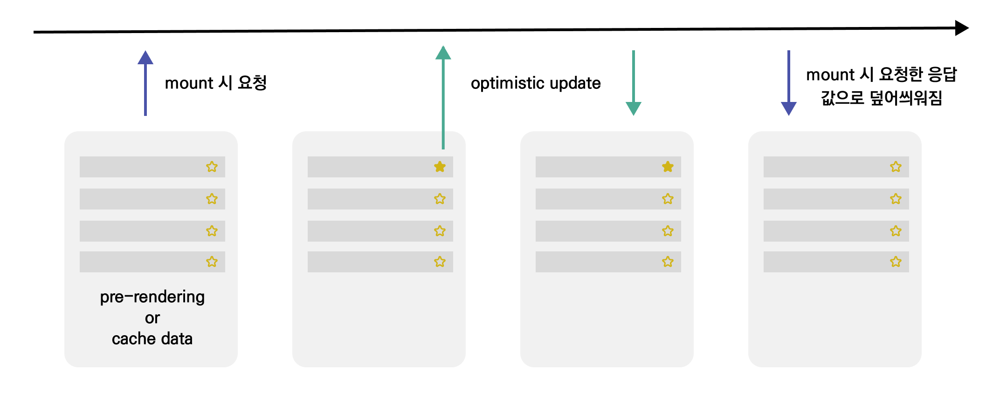

React Query를 사용하다 보면 fetching 상태의 쿼리를 취소해야 하는 상황을 만날 수 있다. 이전까지는 공식 문서에서 흘깃 보며 넘어갔던 내용을 다시 한번 정리하고 쿼리 취소를 수행해야 할 상황을 소개해 보고자 한다.

## React Query의 query 취소 기본동작

결론부터 말하면 React Query는 Promise가 resolve 되기 전에 unmount된 쿼리에 대해 취소하지 않는다.  
자동으로 query를 취소하지 않는 이유는 이러한 동작이 더 유용하기 때문이다.

사용자에게 제공될 A 페이지와 B 페이지가 있다고 가정해 보자. A 페이지 mount 시 쿼리는 fetching 상태가 될 것이다. 이때 fetching이 완료되어 fresh 혹은 stale 상태가 되기 전에 사용자가 A 페이지를 탈출한다면 fetching 상태인 쿼리를 취소하는 대신 캐시에 남겨놓는 것이 추후 다시 방문할 A 페이지에 대한 동일한 데이터의 재 접근 속도를 높일 수 있다.



즉, fetching을 취소하지 않으므로서 다시 A 페이지가 마운트 되고 쿼리가 가비지 컬렉션 되지 않았다면 재사용 할 수 있는 이점이 있다.

## Unmount 된 쿼리를 취소하는 법

그렇다면 fetching 상태인 쿼리가 unmount 되었을때 쿼리를 취소하는 법은 무엇일까?

React Query는 각 쿼리 함수에 AbortSignal 인스턴스를 제공하며 이를 이용하여 unmount 되었을 때 쿼리를 취소시킬 수 있다. 아래는 axios를 사용하였을 때의 예제이다.

```js
const queryResult = useQuery(
  ['key'],
  ({ signal }) => axios.get('https://hub.dummyapis.com', { signal }) // sinal를 넘겨준다.
)
```

위와 같이 AbortSinal 인스턴스를 넘겨주어 AbortController를 fetch 요청과 관계 짓게 할 수 있으며 React Query는 쿼리가 취소되어야 하는 상황에서 AbortController.abort()를 호출하여 요청을 취소하는 sinal를 보낸다.

### AbortController? AbortSignal?

React-Query가 제공하는 AbortSignal이란 무엇일까? AbortSignal이란 DOM 요청(Fetch와 같은)과 통신하고 필요한 경우 AbortController 객체를 통해 취소할 수 있게 해주는 신호 객체이다.  
또한 AbortController는 주로 비동기 작업을 취소하는 데 사용되는 인터페이스로서 프로미스와 함께 사용하여 비동기 작업을 수행하는 중에 작업을 취소하고자 할 때 사용 할 수 있다.

```js
const controller = new AbortController()
const signal = controller.signal

signal.addEventListener('abort', () => {
  console.log('Aborted? ', signal.aborted)
})

setTimeout(() => {
  controller.abort() // 1000ms delay후 abort trigger
}, 1000)
```

AbortController를 직접 사용한다면 위와 같이 먼저 AbortController() 생성자를 사용해 컨트롤러를 객체를 생성하고 AbortController.signal 프로퍼티를 사용해 AbortSignal 객체와 관계된 참조를 얻을 수 있다.

실제로 React Query 라이브러리의 내부 코드를 살펴보면 queryFnContext에 Object.defineProperty를 통하여 signal 이란 프로퍼티를 추가한다. 또한 추가해 준 signal 프로퍼티가 읽히는 시점에 abortSignal를 소비한다는 flag를 true로 바꿔주는 것을 볼 수 있다.

```js
// https://github.com/TanStack/query/blob/main/packages/query-core/src/query.ts#L373

// Adds an enumerable signal property to the object that
// which sets abortSignalConsumed to true when the signal
// is read.
const addSignalProperty = (object: unknown) => {
  Object.defineProperty(object, 'signal', {
    enumerable: true,
    get: () => {
      this.#abortSignalConsumed = true
      return abortController.signal
    },
  })
}

addSignalProperty(queryFnContext)
```

위와 같은 React Query 라이브러리의 내부 과정은 쿼리가 취소되어야 하는 상황에 AbortController라는 인터페이스를 통해 연관 지은 웹 요청을 취소시킬 수 있게 한다.

## Fetching 상태의 쿼리 수동 취소하기

Fetching 중 unmount된 쿼리뿐만 아니라 다른 여러 상황에서 Query를 취소해야 하는 상황이 생긴다. 예를 들어, 요청이 오랜 시간이 걸릴 경우 사용자가 취소 버튼을 클릭하여 요청을 중지하는 기능 혹은 낙관적 업데이트 시에 수동으로 취소할 수 있어야 한다.

쿼리를 수동으로 취소하기 위해서는 queryClient의 cancelQueries를 호출하면 된다. 이렇게 하면 fetching 상태인 쿼리가 취소되고 이전 상태로 되돌아가게 된다.

주의할 점은 cancelQueries를 통한 취소의 경우에도 웹 요청 자체를 취소하지 않는다. signal를 넘겨주어야 웹 요청까지 취소시킬 수 있다.

```js
asd
```

## 낙관적 업데이트시 Cancel Query가 필요할까?

낙관적 업데이트란 서버에서 응답을 받을 때까지 기다리지 않고 사용자에게 빠른 피드백을 제공할 수 있는 기법이다. 페이스북과 인스타그램과 같은 좋아요 기능을 개발한다고 했을 때 낙관적 업데이트를 사용한 다면 다음과 같은 흐름이 될 것이다.

1. mount 시 list fetching 후 UI가 보여지며 유저 인터렉션이 가능한 상태가 됨.
2. 좋아요 클릭 시 업데이트 요청(mutation) 및 즉시 UI 변경.
3. 업데이트 요청과 동시에 이전 쿼리값의 스냅샷을 가져와 변경.
4. 업데이트 요청 실패 시 UI 롤백.
5. 업데이트 요청 성공 시 필요하다면 list fetching key 에 대한 쿼리무효화.

이렇게만 본다면 첫 번째 list fetching 이후에 유저 인터렉션을 받을 수 있는 상태가 되고 그 후에 낙관적 업데이트가 이루어지기 때문에 Cancel Query가 불필요하게 느껴질 수 있지만 문제가 생기는 경우가 존재한다.

### 낙관적 업데이트 시 데이터 꼬임

캐시가 존재하여 mount와 동시에 list가 표출되는 상황, 혹은 서버사이드 렌더링을 통한 pre-rerendering 시에 사용자의 인터렉션에 대한 mutation과 mount 시의 fetching의 타이밍이 가까워질 수 있다.



이러한 경우 위 그림 예시와 같이 mutation의 응답값 보다 mount 시의 fetching의 결과가 더 늦어진다면 낙관적 업데이트의 값이 덮어쓰기 될 수 있는 위험이 존재한다.

그러므로 낙관적 업데이트시에는 Cancel Query를 통해 업데이트 대상 key의 query를 중지 시켜야 한다.

```js
code
```
