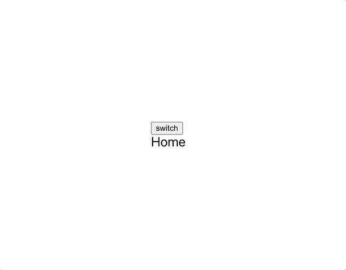
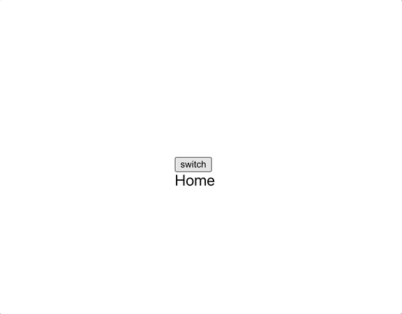

현재 나는 언제든지 프로젝트를 빠르게 진행 할 수 있게 하기위해 나를 위한 보일러플레이트를 만드는 중이다.
eslint와 caro를 적용하였고 Toast, Popup컴포넌트와 상태관리, 테마변경, 선언적 에러처리 기능을 포함시켰다. 앞으로 로그인 기능만 포함시키면 끝이다.  
이번 포스트에서는 이중에서 테마변경에 관한 내용을 작성해보려고 한다.

테마변경 기능을 구현하기 위해서 **Recoil, Styled-components, Local-storage**를 알고 있어야 한다.  
물론 상태관리 라이브러리는 어떤것이든 괜찮다.
보일러플레이트를 만들면서 상태관리는 비동기에 관한것은 모두 제외하고 테마와 로그인한 유저정보만 전역상태로 관리하기로 했다.  
그 이유는 상태관리로 서버데이터의 응답까지 관리하는 경우 클라이언트는 서버 데이터의 **Snapshot**(전역에 저장된 데이터)를 사용하기 때문에
항상 최신데이터를 제공받는다는 법이없고 단일 출처 원칙에 위배된다고 생각하여 서버의 데이터는 전역에서 관리하는 것이 아니라 React-Query를
이용하여 관리하기로 하였다. 이에 관한 내용은 다음에 포스팅 해보도록 하겠다.

## Get ready.

### 1. 테마를 위한 전역상태 제공하기

전역상태에 따라서 Styled-components가 제공하는 Theme Provider에 테마를 넘겨주도록 하기위해
다음과같은 상태를 만들어준다.

```ts
// src/stores/theme.ts
import { atom } from 'recoil'

export enum ThemeFlag {
  light,
  dark,
}

export const themeState = atom<ThemeFlag>({
  key: 'THEME_STATE',
  default: ThemeFlag.light,
})
```

간단한 상태로써 light,dark 값을 가질 수 있고 기본값은 light로 해주었다.

### 2. Theme 작성하기

light 모드일때와 dark 모드일때의 테마를 작성한뒤 export 해준다.
colors 말고도 테마별로 분기하고싶은 여러가지 모듈이 있을 수 있기때문에 각자의 상황에 따라 작성해주도록 하자.
프로퍼티 이름만 colors로 동일하게 해준다.

```ts
// src/styles/theme/index.ts
import * as commons from './common' // Others..

const darkColors = {
  background_color: '#292929',
  text_color: '#ffffff',
}
const lightColors = {
  background_color: '#ffffff',
  text_color: '#000000',
}

export const lightTheme = {
  colors: lightColors,
  ...commons,
}

export const darkTheme = {
  colors: darkColors,
  ...commons,
}

export type Theme = typeof lightTheme | typeof darkTheme
```

이로써 테마를 적용하기 위한 준비가 끝났다.

## Apply theme.

다음으로는 작성한 두개의 테마를 전역으로 관리되는 테마 상태에 따라 알맞게 Theme Provider에 넘겨주어 테마를 적용해 보자.

```tsx{8,9,12}
// src/App.tsx
(...)
import { useRecoilState } from 'recoil'
import { ThemeFlag, themeState } from '@store/theme'
import { lightTheme, darkTheme } from '@styles/theme'

function App() {
  const [currentTheme, setCurrentTheme] = useRecoilState(themeState)
  const theme = currentTheme === ThemeFlag.light ? lightTheme : darkTheme
  return (
    <>
      <ThemeProvider theme={theme}>
        <GlobalStyle />
        <BrowserRouter>
          <Router />
        </BrowserRouter>
      </ThemeProvider>
    </>
  )
}
```

useRecoilState로 현재 테마상태를 가져와서 themeFlag에따라 light 또는 dark테마로 초기화한뒤
ThemeProvider에 넘겨주었다.  
[테마상태](#1-테마를-위한-전역상태-제공하기)의 기본값은 light이므로 초기에는 light 테마가 적용될 것이다.

이와같이 전역에 존재하는 테마의 상태에따라 자동적으로 테마가 알맞게 적용되므로 모드 변경은 전역상태를 바꿔주면 된다.  
그럼 모드를 변경하기 위한 버튼을 만들어보자.

```tsx
// src/components/ThemeSwitch/index.tsx
import React from 'react'
import { useRecoilState } from 'recoil'
import { ThemeFlag, themeState } from '@store/theme'

const ThemeSwitch = () => {
  const [theme, setTheme] = useRecoilState(themeState)

  const handleClick = () => {
    if (theme === ThemeFlag.light) {
      setTheme(ThemeFlag.dark)
    } else {
      setTheme(ThemeFlag.light)
    }
  }

  return <button onClick={handleClick}>switch</button>
}
```

useRecoilState를 사용해 전역의 상태를 불러와서 버튼이 눌렸을때 토글시켜주었다.  
이제 테마변경 기능을 테스트하기 위해 테마에 따라서 Global 스타일이 변경되게 해보자.

```ts
// src/styles/global/index.ts
import { createGlobalStyle } from 'styled-components'
import { Theme } from '@styles/theme'

const GlobalStyle = createGlobalStyle<{ theme: Theme }>`
   (...생략)
  body {
    (...생략)
    background-color: ${({ theme }) => theme.colors.background_color};
    color: ${({ theme }) => theme.colors.text_color};
    transition-property: background-color, color;
    transition-duration: .5s;
  }
`
```

위와같이 body에서 배경색과 글자색을 [제공된테마](#2-theme-작성하기)를 이용하여 설정해 주었고 자연스러운 효과를위해
transition을 추가하였다.
참고로 Typescript 환경에서 GlobalStyle말고 일반 style를 만들때는 아래처럼 제네릭 없이도 theme에 접근이 가능하다

```tsx
// e.g
const StDiv = styled.div`
  font-size: ${({ theme }) => theme.fontSizes.xxl};
`
```

## 1st result



적용한 결과는 위와 같다. 버튼을 눌렀을때 테마 변경은 정상적으로 이루어지지만 새고로침을 하였을때
테마가 유지 되지 않고 풀려버린다.  
이것을 해결하기위해 localStorage를 이용해보도록 하자.

## 테마 변경 버튼을 눌렀을때 localStorage에도 상태를 저장하기

일단 테마변경 버튼을 눌렀을때 전역상태를 변경하는것 뿐만 아니라 localStorage에도 상태를 저장하도록 하겠다.  
Recoil를 사용하는 경우 [AtomEffact](https://recoiljs.org/docs/guides/atom-effects/#local-storage-persistence)를 사용하여
전역상태가 바뀔때의 SideEffact로 localStorage에도 저장해줄수 있어 보인다.  
하지만 이번 글에서는 직접 localStorage에 저장시켜 보겠다.

```tsx
// src/components/ThemeSwitch/index.tsx
(...)
import { useRecoilState } from 'recoil'
import { ThemeFlag, themeState } from '@store/theme'
import { setThemeToStorage } from '@utils/storage'

const ThemeSwitch = () => {
  const [theme, setTheme] = useRecoilState(themeState)

  const handleClick = () => {
    if (theme === ThemeFlag.light) {
      setTheme(ThemeFlag.dark)
      setThemeToStorage(ThemeFlag.dark)
    } else {
      setTheme(ThemeFlag.light)
      setThemeToStorage(ThemeFlag.light)
    }
  }

  return <button onClick={handleClick}>switch</button>
}

export default ThemeSwitch
```

setThemeToStorage라는 함수를 만들어서 버튼을 클릭했을때 localStorage에도 테마상태를 저장해주었다.  
자세한 코드는 [GitHub](https://github.com/je0ngyun/react-ts-boilerplate/blob/master/src/utils/storage/index.ts)에서 볼 수 있다.

## 앱이 로드될때 localStorage를 확인하여 전역상태 업데이트 해주기

useEffact를 사용하여 앱이 로드될때 localStorage에 있는 테마상태로 전역상태를 업데이트 해주자.

```tsx{9,11,12,13,14,15,16}
// src/App.tsx
(...)
import { useRecoilState } from 'recoil'
import { ThemeFlag, themeState } from '@store/theme'
import { lightTheme, darkTheme } from '@styles/theme'

function App() {
  const [currentTheme, setCurrentTheme] = useRecoilState(themeState)
  const theme = currentTheme === ThemeFlag.light ? lightTheme : darkTheme

  useEffect(() => {
    const storageTheme = getThemeFromStorage()
    if (storageTheme !== undefined) {
      setCurrentTheme(storageTheme)
    }
  }, [])

  return (
    <>
      <ThemeProvider theme={theme}>
        <GlobalStyle />
        <BrowserRouter>
          <Router />
        </BrowserRouter>
      </ThemeProvider>
    </>
  )
}
```

위와같이 localStorage에 값이 있으면 전역상태를 업데이트하게 되고 결과적으로 전역상태에 의존적이던
theme 변수가 변경이되기 때문에 테마 변경이 이루어진다.

## Result



최종결과 새로고침시에도 테마가 유지되는것을 볼 수 있다.

## 마치며..

전역상태관리와 styled-components를 사용하지 않아도 충분히 darkmode를 구현할 수 있다.
지금 이 글을 쓰고있는 블로그의 darkmode도 Sass만을 사용하여 구현하였다.
이번에 Sass가 아닌 recoil과 styled-components를 사용하여 구현을 해본 후 느낀점은 개개인마다 다를순 있으나 Sass를 이용한 방법보다 직관적이고 편했다.  
Sass를 사용하여 구현하였을땐 [색상에 관련된 CSS코드를 따로 모아두어야 했었다](https://github.com/je0ngyun/gatsby-starter-oasis/blob/master/src/styles/light-mode.scss) 하지만
styled-components에서는 Theme Provider 덕분에 각 테마에따른 Color만 나눠주고 자연스럽게 사용만 하면 되었기 때문에 좋았던 것 같다.
