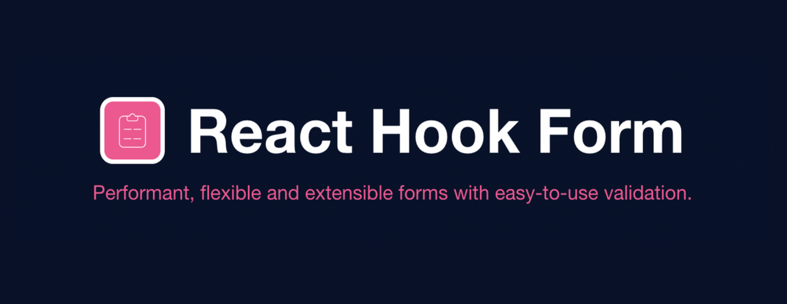

React에서 입력 Form을 useState를 사용한 Controlled 방식으로 관리하다보면 Form이 복잡해지고 관리해야하는 수가 늘어날수록
코드의 양도 방대해진다. 더군다나 보통 하나의 Input에는 유효성 검사와 그에 따른 Error처리 관련 로직이 따라 붙으므로 적절하게 컴포넌트화가
되어있지 않다면 그야말로 지옥이 되어버린다..  
그래서 입사를하고 나서부터는 각 Input의 value가 state가 아닌 DOM에 저장되는 방식인 Uncontrolled Form을 사용하기로
하였고 Form을 Uncontrolled방식으로 보다쉽게 다룰 수 있게하는 [React-Hook-Form 라이브러리](https://react-hook-form.com/)를 적극 사용하였다.
그래서 이번엔 react-hook-form을 사용하면서 마주쳤던 상황을 정리해보는 시간을 가져보려고 한다.

## 1. 기본사용

기본적으로 대부분의 폼은 다음과 같은 형식일 것 같다. 나와같은 경우에는 더 좋은 사용자 경험을 위해 onChange mode를 사용해왔다.
mode 설정을 통해 유효성 검사 시점을 정할 수 있다. onChange 모드는 각 Input의 change 이벤트가 발생할시 유효성 검사가 trigger 된다.
또한 유효성 검사 실패시 formState의 errors를 통해 메세지를 손쉽게 표출시킬수 있다.

```tsx
const Signup = () => {
  const {
    register,
    handleSubmit,
    formState: { errors },
  } = useForm<SignUpForm>({ mode: 'onChange' })

  const handleSignupFormSubmit = (formValue: SignUpForm) => {
    // submit시 로직
  }

  return (
    <form onSubmit={handleSubmit(handleSignupFormSubmit)}>
      <label htmlFor="user-id-input">아이디</label>
      <input
        {...register('userId', {
          required: Message.valid.REQUIRE_ID,
          pattern: {
            value: RegExps.user.ID,
            message: Message.valid.INVALID_ID,
          },
        })}
        id="user-id-input"
        placeholder="아이디를 입력해 주세요."
        type="text"
      />
      <div role="alert">{errors.username && errors.username.message}</div>
    </form>
  )
}

export default Signup
```

## 2. pattren을 통한 유효성 검사 지정

register의 두번째 인자인 Options의 pattern를 통해 유효성 검사 정규식을 지정할 수 있다.
이때 패턴을 객체로 재공하면 유효성 검사가 실패했을시 메시지도 지정해 줄 수 있다.
또한 이와 유사한 방식으로 require에도 메시지를 지정해 줄 수 있다.

```tsx{17,18,19,20}
const TestForm = () => {
  const {
    register,
    handleSubmit,
    formState: { errors },
  } = useForm<FindIdForm>({ mode: 'onChange' })

  const handleSubmitForm = (formValues: FindIdForm) => {
    ///..
  }

  return (
    <form onSubmit={handleSubmit(handleSubmitForm)}>
      <label htmlFor="user-name-input">이름</label>
      <input
        {...register('name', {
          required: '이름을 입력해 주세요.',
          pattern: {
            value: /^[가-힣]{2,5}$/,
            message: '올바른 형식의 이름을 입력해 주세요.',
          },
        })}
        id="user-name-input"
        placeholder="이름을 입력해 주세요"
        type="text"
      />
      <div>{errors.name && errors.name.message}</div>
      <button type="submit">제출</button>
    </form>
  )
}

export default TestForm
```

## 3. validate를 통한 유효성 검사 지정

register의 두번째 인자인 Options의 validate를 통해 유효성 검사 함수를 지정할 수 있다. 이때 해당 함수의 첫번쨰 파라미터로
필드의 값이 들어가게된다. 이를 이용하여 다양한 형태로 유효성 검사를 진행 할 수 있다.
아래 예시는 지정된 필드를 감시하는 watch를 추가로 사용하여 비밀번호 확인 유효성 검사를 진행한다.
이를 통해 비밀번호필드와 비밀번호 확인 필드의 값이 같은지 쉽게 검사할 수 있다.

```tsx{12,13,14,24}
const TestForm = () => {
  const {
    register,
    handleSubmit,
    watch,
    formState: { errors },
  } = useForm < PasswordForm > { mode: 'onChange' }

  const handleSubmitForm = (formValues: PasswordForm) => {
    ///..
  }

  const validateConfirmPasswordField = (value: string) =>
    value === watch('password') || Message.valid.INVALID_PASSWORD_CONFIRM

  return (
    <form onSubmit={handleSubmit(handleSubmitForm)}>
      <div>
        <label htmlFor="user-confirm-password-input">비밀번호 확인</label>
      </div>
      <input
        {...register('confirmPassword', {
          required: '비밀번호를 다시 입력해 주세요.',
          validate: validateConfirmPasswordField,
        })}
        id="user-confirm-password-input"
        type="password"
        placeholder="비밀번호를 다시 입력해 주세요."
      />
      <div>{errors.confirmPassword && errors.confirmPassword.message}</div>
    </form>
  )
}

export default TestForm
```

이를 더 응용하면 아래와 같이 타 검증 라이브러리를 이용하여 유효성 검사를 진행 할 수도 있다.
아래는 내부적으로 google-libphonenumber를 사용하는 util함수로 선택된 국가코드에 알맞게
핸드폰 번호의 유효성 검사를 진행한다.

```jsx{5,6,7,17}
const TestForm = () => {

  //생략...

  const validatePhoneField = (value: string) =>
    I18Phone.phoneValidater(value, watch('phoneRegionCode')) || Message.valid.INVALID_PHONE


  return (
    <form onSubmit={handleSubmit(handleSubmitForm)}>
      {/* 생략... */}
      <div>
        <label htmlFor="user-phone-input">전화번호</label>
      </div>
      <input
        {...register('phone', {
          required: Message.valid.REQUIRE_PHONE,
          validate: validatePhoneField,
        })}
        id="user-phone-input"
        placeholder="전화번호를 입력해 주세요"
        type="number"
      />
      <div>{errors.phone && errors.phone.message}</div>
    </form>
  )
}

export default TestForm
```

## trigger를 사용한 선택적 유효성 검사

## setError를 사용한 custom error 표출

## error handle 한번에 처리

## onChange Event

fitFieldMaxLength

## ref 공유하기

## render props 패턴을 통한 form 관심사 분할
