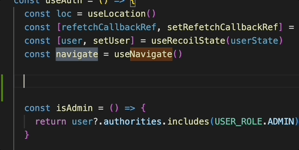
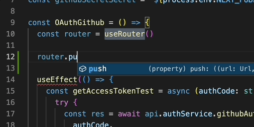

VSCode, Intellij 등 IDE와 함께 타입스크립트를 사용하는 환경이라면 IDE 상에서 타입 자동완성을 지원한다. 이번 포스트에서는  
이러한 IDE의 타입 자동완성 기능과 외부 모듈의 타입 치환을 통해 react-router-dom의 `navigate`, Next의 `useRouter().push`등을 사용할때
미리 지정해 놓은 라우팅 경로가 자동완성 목록에 표출되게 만들어 보는법을 소개하려고 한다.

## 1. Route Path를 Constant Union으로 선언해 놓기

먼저 프로젝트에서 사용할 Route Path를 Constant Union으로 선언해 놓는다. 타입스크립트의 Enum은 컴파일시 객체가 생성되며 tree shaking이 되지 않기 때문에
`as const`를 이용한 union 타입을 이용하였다. (readonly 처리 및 타입추론범위 줄이기)

```ts
//src/constant/routePath.ts
export const ROUTE_PATH = {
  Landing: '/',
  Home: '/home',
  Dashboard: '/home/dashboard',
  MyPage: '/my-page',
  ///....
} as const

export type ROUTE_PATH = typeof ROUTE_PATH[keyof typeof ROUTE_PATH]
```

## 2. 외부 모듈(react-router-dom)의 타입 치환하기.

타입스크립트의 `interface`는 선언적 확장이 가능하다. `interface`의 선언적 확장과 오버로딩을 이용하면 외부 모듈의 타입을 치환할 수 있다.

먼저 엠비언트 모듈 파일 (d.ts) 파일을 생성한다. 앰비언트 모듈 선언 파일은 컴파일 대상에 해당 모듈이 포함된다면 타입 정보를 참조할 수 있게 된다.
이를 이용해 `react-router-dom` 모듈의 타입을 참조해 `useNavigate`가 반환하는 `navigate` 함수의 타입에 오버로딩을 하여 미리 선언해 놓은 라우팅 경로가 자동완성에 표시될 수 있도록 한다.

```ts
//src/types/module.d.ts

import { NavigateOptions } from 'react-router-dom'

type RoutePaths = import('@constant/routePath').ROUTE_PATH

declare module 'react-router-dom' {
  interface NavigateFunction {
    (to: RoutePaths, options?: NavigateOptions): void
  }
}
```

이렇게 외부타입을 치환해주면 아래와 같이 `navigate` 함수를 사용할 때 자동완성으로 라우팅 경로가 표출된다.



## 3. NextJs의 useRouter().push에 적용하기

`react-router-dom` 과 같은경우 라이브러리에 선언된 `navigate` 함수의 타입을 이용해 오버로딩 했다면
Next의 경우에는 `useRouter` 훅이 반환하는 객체의 `push 메서드`의 타입을 치환하기위해 `useRouter` 함수 자체를 오버로딩 해주었다.

```ts
//src/types/module.d.ts
import { NextRouter } from 'next/router'

type RoutePaths = import('constant/routePath').ROUTE_PATH

type RoutePushMethod = (path: RoutePaths) => Promise<boolean>

declare module 'next/router' {
  function useRouter(): NextRouter & { push: RoutePushMethod }
}
```

위와같이 선언을 해주면 push 메서드 사용시 라우팅 경로가 자동완성에 표출된다.


