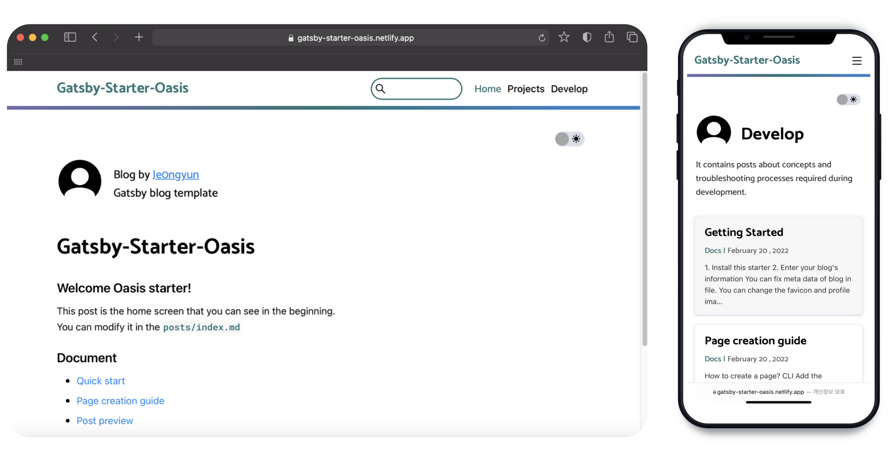

## Table Of Contents

> - [Motivation](#motivation)
> - [Why use gatsby?](#why-use-gatsby)
> - [Key Functions](#key-functions)
> - [Learned it](#learned-it)

## Motivation

약 반년전 개인블로그를 React와 Gatsby 프레임워크를 통해 제작한 후에 진로방향을 웹 프론트엔드 개발자로
결정하였습니다.  
두달간 Javascript를 새로 공부함과 동시에 틈틈히 코딩테스트 문제도 Javascript로 풀어보는 시간을 가졌습니다.  
두달이 지난 후 과거에 진행했던 프로젝트 코드를 보게 되었고 리펙토링의 필요성을 느꼈습니다.
리펙토링을 진행하면서 아직 부족한 실력이지만 남들도 쉽게 사용할 수 있는 템플릿을 하나 만들어보자 라고 결심하였고
많은 블로그 템플릿이 있지만 페이지별로 관심사를 나누어 포스팅 할 수 있는 템플릿은 찾아보기 힘들었기 때문에 페이지별로 관심사를 나눌수 있게 하는것을 주 목표로 하여 프로젝트를 진행하게 되었습니다.

## Why use gatsby?

많은 유입을 통해 내 게시물을 더 널리 알려야하는 블로그의 특성상 SEO의 적용은 필수였습니다. 또한 프론트엔드에만 집중하기 위해 추가적인 서버를 개발하고싶지 않았고
SSG 프레임워크를 통해 마크다운으로 포스트를 작성하고 배포시점에 미리 페이지를 생성하는 방식을 사용하기로 결정하였습니다.  
SSG를 지원하는 프레임워크로는 React 진영의 **Next, Gatsby** 와 Vue 진영의 **Nuxt, Vue Press** 가 있었고
저는 React에 흥미가 좀더 있고 더 공부하길 원했기 때문에 Next와 Gatsby로 선택지를 좁혔습니다. 이중 Gatsby의 GraphQl로 포스트(마크다운 파일)를 조회하는 방식이
마음에들었으며 SSG에 특화된 여러 플러그인들을 쉽게 검색하고 적용할 수 있었기 때문에 Gatsby를 선택하게 되었습니다.

## Key Functions

블로그 스타터의 주요 기능은 다음과 같습니다.

### 페이지 기반 관심사 분류

Next나 Gatsby의 **파일기반 정적 라우팅 방식**처럼 사용자가 특정위치에 마크다운 파일을 생성하면 폴더구조에 따라 자동으로 주소가 생성되게 하고 싶었습니다. 이를위해 먼저 posts 폴더를 하나 만들어서 기준점으로 설정하고 하위에 생성되는 폴더구조에 따라 포스트의 주소가 자동적으로 알맞게 부여 될 수 있도록 개발하였습니다.

```bash
./posts
├── index.md # 홈화면 내용
└── projects # 프로젝트 페이지의 게시물들
    ├── BE # 세부 카테고리 (사이드바 카테고리에 포함)
    │   ├── 10plusServer.md
    │   └── Cardme.md
    └── FE # 세부 카테고리 (사이드바 카테고리에 포함)
        ├── 10plusKiosk.md
        ├── Gatsby-starter-oasis-img
        │   ├── CLI-tool.gif
        │   └── intro-img.png
        └── Gatsby-starter-oasis.md # 현재 포스트

```

**위는 현재 포스트를 작성하는 시점의 일부 폴더구조입니다.**  
현재 포스트인 `Gatsby-starter-oasis.md` 파일은 `${사용자주소}/projects/FE/Gatsby-starter-oasis/`의 URI로 생성됩니다.

이를 구현하기 위해 Gatsby에서 markdown파일만을 조회하는 플러그인 대신 쿼리가 길어질 수 있지만 [전체 파일을 조회하여 필터링](https://github.com/je0ngyun/gatsby-starter-oasis/blob/master/src/pages/projects/index.js#L52) 하는 방식을 사용하였습니다.

### 보다 쉬운 페이지 생성을 위한 CLI tool

페이지기반으로 포스트를 분류했지만 여전히 문제점은 남아있었습니다. 사용자가 새로운 주제의 페이지를 만들고자 할때 해야할 작업이 많아지기 때문이었습니다. 이를 해결하기 위해 쉬운 페이지 생성을 위한 CLI tool을 개발하였습니다.


**위는 CLI tool을 실행하여 Life란 이름의 페이지를 생성하는 모습입니다.**  
만들 페이지 이름 및 페이지 설명을 입력하면 자동으로 Gatsby가 라우팅 하는 `./src/pages/` 폴더에 기입한 정보를 바탕으로 파일이 만들어지고 `./posts/` 폴더의 하위에도 life란 이름의 폴더가 새로 만들어지게 됩니다.  
그 덕분에 사용자는 아래와 같이 config 파일에 페이지를 추가하기만 하면 될 수 있게 하였습니다.

```js
//user-meta-config.js
const pageMetadata = {
  //menu - Please enter a menu link to add to the navbar.
  //If you do not want to add a link to the navbar, you can leave it blank.
  menu: [
    { path: '/', linkname: 'Home' },
    { path: '/projects', linkname: 'Projects' },
    { path: '/develop', linkname: 'Develop' },
    { path: '/life', linkname: 'Life' }, // 새로 추가!
  ],
  //directorys - Enter the directory to be mapped with the page.
  //That directory is automatically linked to the gatsby filesystem.
  directorys: ['develop', 'projects', 'life'], // life 추가
}
```

### 쉬운 포스트 탐색을 위한 사이드바 및 포스트검색기능

  
위와같이 페이지 별로 관심사를 분류하는것 만으로는 부족한것 같아 사이드바를 통해 세부적으로 분류된 포스트를 볼 수 있게 하였고 현재 어느 카테고리의 포스트를 읽고있는지 알 수 있게 하이라이트 기능을 추가하였습니다.
또한 제목 및 태그를 기반으로 검색할 수 있는 검색창도 추가하였습니다.

### 통합된 Config File

사용자가 초기에 블로그를 자신의 정보로 세팅할때 불편함이 없도록 사용자 기본정보는 물론 Google이나 Naver의 Search console verification code나 Google analytics tracking ID등을 `user-meta-config`이라는 설정파일 안에서 모두 설정할 수 있도록 하였고 프로필 이미지와 favicon은 지정된 이름 (favicon, profile) 으로 `./assets` 폴더에 넣으면 자동 적용되도록 하였습니다.

## Learned it

### State의 lazy initialization

State의 초기값으로 비싼비용의 계산이 필요할 경우 lazy 초기화를 통해 리 렌더링시 불필요한 계산을 줄이는 법을 배웠고 최초 렌더링 시에만 해당 값이 필요할함과 동시에
`localStorage` 의 접근 및 `배열조작의` 결과물을 State로 써야한다면 lazy 초기화를 적극적으로 활용해야한다는 것을 알게되었습니다.  
해당 프로젝트에서 사이드바를 열었을때 현재 보고있는 페이지의 카테고리를 하이라이팅함과 동시에 자동적으로 열리게 구현하였고 이를 위해 categoryStatus 라는 State를 lazy 초기화 하였습니다.

### CSR, SSR, SSG 의 개념

Gatsby 프레임워크에서 제공하는 `useStaticQuery` Custom hook이 반환하는 결과값이 같아도 변경된것으로 간주되어 [리렌더링을 유발하는 이슈가](https://github.com/gatsbyjs/gatsby/issues/29011) 있었습니다.
찾아본 결과 이러한 현상은 부분적으로 의도된것이며 SSG는 빌드시에 HTML을 모두 생성하기 때문에 개발시에만 영향이 있고 실제 배포에는 영향이 없다는 것을 알게됨과 동시에 여러 렌더링 방식에 대한 개념이 부족한 것 같아서
CSR, SSR, SSG 및 TTV,TTI 에대한 개념과 렌더링 방식들간에 어떤차이가 있고 어떠한 상황에 써야할지 공부해보는 시간을 가졌습니다.

### Intersection Observer

페이지내 포스트아이템의 무한스크롤을 구현하기 위해 메인쓰레드에 영향을 줄 수 있고 리플로우를 유발하는 Scroll Event 대신 Intersection Observer를 공부하여 적용하였습니다.
해당 기능구현시 5개씩 포스트아이템이 추가되도록 하였으며 5개씩 포스트를 불러올때 맨 마지막 포스트를 관찰하도록 하였고 관찰되는 아이템박스가 Viewport 안에 들어오면 연속해서 5개의 포스트를 불러옴과 동시에
관찰대상을 바꾸어주었습니다.

### requestAnimationFrame

스크롤 게이지바를 적용하기 위해 스크롤 이벤트를 등록해야했습니다. 이때
requestAnimationFrame을 사용한 throttle로 브라우저가 처리할수 있는 범위내에서 이벤트를 처리하는 방법을 알게되었으며 Javascript의 이벤트루프와 태스크큐에대해 다시 공부해 보며 왜
setTimeout의 시간이 정확하지 않을 수 있는지 requestAnimationFrame 으로 어떻게 최적화 할 수 있는지를 배우게 되었습니다.
